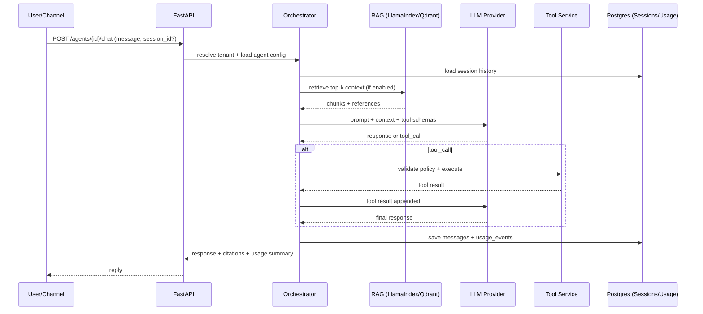

# Agentic AI Platform – Architecture Specification (Deep)

This document is the authoritative architecture and engineering spec for a multi-tenant Agentic AI Platform.
It is written to be used as an implementation prompt for coding agents and human developers.

---

## 0. Scope and Goals

### Primary Goal
Build a Python-first, production-grade platform where companies can create and operate:
- **Chat agents** (web widget, API, messaging connectors)
- **Voice agents** (receptionist-style real-time voice)
- **Task agents** (background workflows that use tools/APIs)

Agents must be **configurable** (low-code) with:
- prompts, rules, behaviors
- tool allowlists and policies
- knowledge base (RAG)
- memory/session handling
- usage tracking and billing

### MVP Deliverables (must ship first)
1. Multi-tenancy: companies, users, roles, API keys, tenant isolation.
2. Agent CRUD: create, edit, disable; config stored as JSON.
3. Chat runtime: session + messages + tool calling + persistence.
4. KB (RAG): upload → async index → retrieve at inference time.
5. Tools: builtin + HTTP tools with JSON-schema validation and per-agent allowlists.
6. Usage metering: tokens, tool calls, KB queries; stored as usage events.
7. Billing foundation: monthly aggregation + invoice draft generation.
8. Observability: structured logs, correlation IDs, basic metrics endpoints.

### v1 Expansion
- Multi-agent workflows (planner/executor/reviewer) with async runs
- Voice pipeline (STT/TTS) integrated via WebSocket/LiveKit
- Channel connectors (Slack/WhatsApp/Telegram)
- Agent versioning and rollback
- Admin analytics dashboard

### Non-goals (v1)
- Model fine-tuning pipelines
- Fully autonomous self-modifying agents
- Full CRM/ERP suite; integrations are tools

---

## 1. Architectural Principles

1. **Tenant isolation is absolute**: data, vectors, secrets must never leak across companies.
2. **Config-first**: agent logic is defined by configuration and policies; code implements engine + primitives.
3. **Channel-agnostic core**: chat/voice/whatsapp are adapters; orchestrator is the brain.
4. **Tools are explicit and schematized**: tools have JSON schema, allowlists, and audited execution.
5. **Observable by default**: every request has request_id; every model/tool call emits usage + logs.
6. **Fail safe**: timeouts, budgets, circuit breakers; graceful degradation.
7. **Replaceable components**: LLM provider and vector DB should be abstracted behind interfaces.

---

## 2. High-Level Architecture

### Logical view

- **Frontend**: Agent Studio UI (low-code builder), Analytics
- **API Gateway / Backend (FastAPI)**:
  - Auth and tenant resolution
  - Agent CRUD
  - Chat/Session endpoints
  - KB endpoints
  - Tool endpoints
  - Usage/billing endpoints
- **Agent Orchestrator (Core Runtime)**:
  - Prompt assembly
  - Memory management
  - RAG retrieval
  - Tool loop (function calling)
  - Multi-agent execution (later)
- **Workers (Celery)**:
  - KB indexing
  - Workflow runs
  - Billing aggregation
- **Storage**:
  - Postgres (source of truth)
  - Redis (cache, rate limiting, locks)
  - Qdrant (vectors)

### Suggested repo layout (reference)
See `docs/` set; code skeleton should follow:
- routers only validate and dispatch
- services implement business logic
- adapters wrap external systems

---

## 3. Core Components and Responsibilities

### 3.1 API Gateway (FastAPI)
Responsibilities:
- Authentication (JWT for UI users; API keys for external calls)
- Tenant context injection into request lifecycle
- Rate limiting and quotas
- Request validation and response shaping (standard envelope)
- Correlation IDs and logging context

Hard rules:
- No database queries without `company_id` filter.
- No secrets in logs.
- Do not embed orchestration logic in routers.

---

### 3.2 Agent Orchestrator (Runtime Brain)
The orchestrator executes a “turn” and is channel-agnostic.

**Inputs**
- company_id
- agent_id
- session_id (optional; created if missing)
- channel (web/api/whatsapp/voice)
- user message or transcript chunk
- optional metadata (user_external_id, locale, timezone, etc.)

**Outputs**
- assistant response (text or structured JSON)
- citations (optional)
- tool execution summaries (optional)
- usage summary (tokens, tool calls, KB ops)
- updated session state

**Orchestrator steps (single turn)**
1. Load agent config + policies + tool allowlist
2. Load session context (messages) with windowing
3. Apply memory policy (short-term, summaries, etc.)
4. Run RAG retrieval (if enabled)
5. Build model input:
   - System prompt + rules
   - Retrieved context (delimited)
   - Message history
6. Register tools (JSON schemas)
7. Call LLM
8. If tool_call:
   - validate policy + schema
   - execute tool
   - append tool result into conversation
   - loop back to LLM with tool result
9. Validate final output (if expecting structured response)
10. Persist messages and usage events
11. Return response

**Guardrails**
- max tool calls per turn
- max loops per request
- URL allow/deny list for HTTP tools
- “sensitive” data redaction in logs
- prompt injection mitigation:
  - retrieved context is clearly delimited and marked as untrusted
  - tool allowlist + schema validation
  - forbid “tool selection” override from user

---

### 3.3 LLM Provider Layer
Abstraction to support multiple providers:
- OpenAI (initial)
- Local (Ollama) or other providers later

Responsibilities:
- uniform request/response types
- usage extraction (tokens in/out, latency)
- retries/backoff (idempotent requests only)
- timeouts and circuit breaker hooks

---

### 3.4 RAG Service (LlamaIndex + Qdrant)
Responsibilities:
- document ingestion pipeline:
  - upload → store metadata → extract → chunk → embed → upsert vectors
- retrieval pipeline:
  - embed query → retrieve top_k → filter by tenant and agent → return chunks + refs

Key requirements:
- Must filter by company_id and agent_id at retrieval time.
- Must support async indexing via workers.
- Must store document metadata and chunk references for citations.

Chunking guidelines:
- default chunk size: 600–1200 tokens equivalent (approx)
- overlap: 10–20%
- keep section headers if possible
- store chunk_id and source metadata (doc_id, page, offset)

---

### 3.5 Tool Service
Tool execution is a first-class system with auditing and policies.

Tool types:
1. **Builtin tools** (Python functions)
2. **HTTP tools** (external APIs)
3. **Workflow tools** (enqueue a background job and optionally return a job_id)
4. (optional later) **DB tools** (controlled SQL with allowlisted queries)

Tool contract:
- name (namespace.name)
- description
- input_schema (JSON schema)
- output_schema (optional)
- auth requirements
- timeout
- retry policy
- rate limits
- redaction rules for logging

Policies:
- per-agent allowlist
- per-tool call budget (daily/monthly)
- per-turn max tool calls
- allowed URLs/domains for HTTP tools
- PII handling rules

---

### 3.6 Session, Memory, and State
Concepts:
- **Session**: conversation instance tied to agent + user_external_id + channel
- **Message**: user/assistant/tool/system records
- **Memory policies**:
  - short-term: N recent messages
  - summarization: keep a summary of earlier messages
  - semantic memory: optional vectors from conversation (future)

MVP memory:
- store full message history in Postgres
- use windowing to keep prompt size bounded
- optional: store running “session_summary” (later)

---

### 3.7 Usage Metering and Billing
Meter:
- tokens_in / tokens_out per LLM call
- tool calls
- KB query operations
- audio seconds (voice)

Store:
- append-only `usage_events` records
- monthly aggregation job generates invoice draft

Billing invariants:
- usage events are immutable
- invoice drafts recomputable from events
- pricing is versioned by plan_id (future)

---

### 3.8 Channel Adapters
Channel adapters normalize incoming events into orchestrator requests.

MVP channels:
- REST chat (server-to-server)
- Web UI chat (REST/WebSocket optional)

v1 channels:
- Voice: WebSocket/LiveKit
- Slack/WhatsApp/Telegram: webhook adapters

Adapters responsibilities:
- authentication
- message normalization
- acknowledgements/retries
- idempotency keys for webhook events

---

## 4. Security and Compliance Baseline

### 4.1 Authentication
- UI users: JWT session or OAuth
- External callers: API keys (hashed storage)
- Service-to-service: internal auth token or mTLS (later)

### 4.2 Authorization (RBAC)
- Company roles: admin, operator, viewer
- Permissions are explicit:
  - manage agents
  - view sessions
  - manage tools
  - manage KB
  - view billing
  - manage keys

### 4.3 Tenant Isolation
Enforce:
- company_id on every table
- ORM query helpers that require tenant scope
- Qdrant payload filters by company_id and agent_id
- Tool credentials scoped by company_id

### 4.4 Secrets Management
- Store tool credentials encrypted at rest (KMS later)
- Never log secrets
- Redact sensitive fields in tool args/results before logging

### 4.5 Data Retention
- messages retained by default (configurable later)
- audit logs append-only
- allow future “retention policy per tenant”

---

## 5. Observability Requirements

### Logging
- JSON structured logs
- include request_id, company_id, agent_id, session_id
- tool calls logged with redacted fields

### Metrics (MVP)
- request count and latency (per endpoint)
- LLM call latency and token usage
- tool call failures
- queue depth (worker)

### Tracing (v1)
- OpenTelemetry spans for:
  - API request
  - orchestrator turn
  - LLM call
  - tool execution
  - RAG retrieval

---

## 6. Deployment and Environments

### Local
- docker-compose: api, worker, postgres, redis, qdrant
- `.env` for keys and connection strings

### Staging/Prod (future)
- Kubernetes:
  - api deployment (HPA)
  - worker deployment (HPA)
  - Postgres managed
  - Qdrant managed or statefulset
- Ingress controller
- Secrets via secret manager

---

## 7. Engineering Standards

### Code organization
- `routers/` thin
- `services/` contains business logic
- `adapters/` wrap external services
- `models/` SQLAlchemy
- `schemas/` Pydantic DTOs
- `workers/` Celery tasks

### Tooling
- black, ruff, mypy
- pytest
- pre-commit

### Versioning
- Semantic version for platform releases
- Agent version increments on config changes

### Backward compatibility
- API versioning under `/api/v1`
- additive changes preferred

---

## 8. Acceptance Criteria

MVP acceptance:
- Create company + API key
- Create agent with prompt/rules
- Start session and chat
- Upload KB docs → indexing → retrieval influences answers
- Configure and attach tools → agent can call tools with schema validation
- Usage events created per interaction
- Invoice draft generated for a given period
- Tenant isolation verified with tests

---

## Appendix A – Mermaid Flow (Chat + RAG + Tools + Usage)

